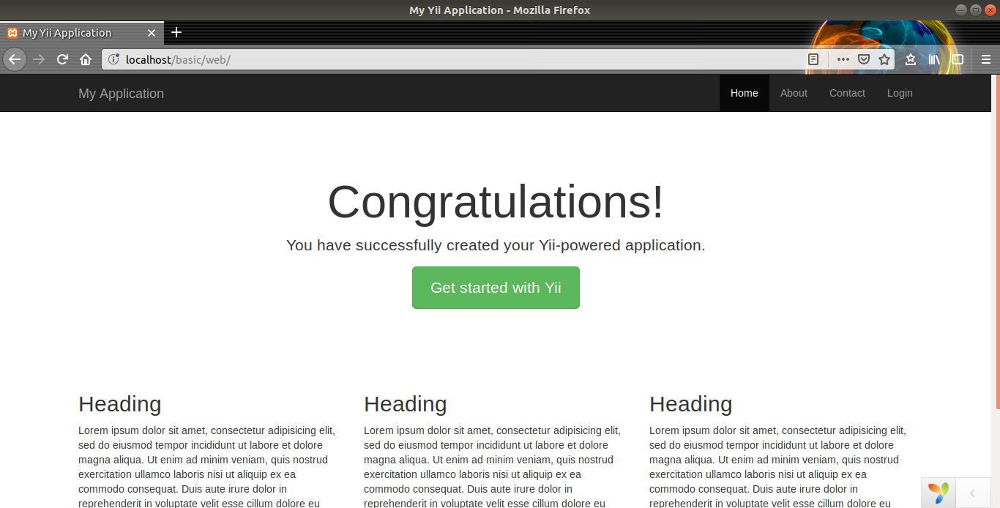
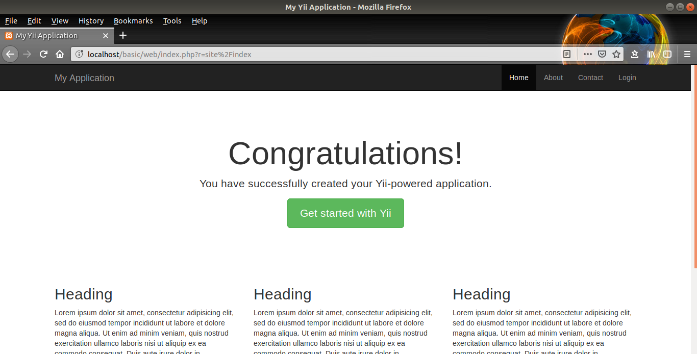
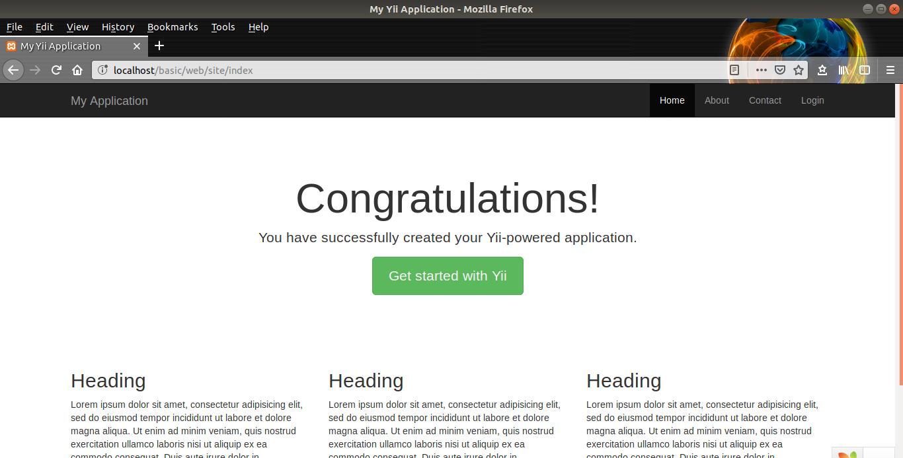

# Pengantar Framework Yii2

- Sebelum menggunakan framework yii2 perlu menginstall program composer untuk mendownload projectnya, berikut cara install program composer pada sistem operasi Linux :
    - Buka Terminal dan ketik perintah berikut
    - sudo apt-get install curl php-cli php-mbstring git unzip
    - curl –sS https://getcomposer.org/installer | php
    - sudo mv composer.phar /usr/local/bin/composer
    - composer
    - composer self-update
- Jika composer sudah terinstall maka lanjut dengan mendownload project yii2 seperti berikut :
    - Buka Terminal
    - cd /var/www/html atau cd /opt/lampp/htdocs
    - composer create-project yiisoft/yii2-app-basic basic
        - Kata basic diakhir kalimat merupakan nama project yang akan dibuat
- Jika sudah selesai download project yii2 maka lakukan perintah berikut :
    - Buka Browser
    - Buka URL : http://localhost/basic/web
    - Jika ada tulisan Congratulations! maka project berhasil terinstall seperti gambar berikut



- Kemudian coba tekan menu Home di navigasi bar di atas kanan maka URL tersebut menjadi seperti http://localhost/basic/web/index.php?r=site%2Findex URL tersebut sulit dihafal seperti gambar berikut :



- Untuk mempermudah menghafal URLnya maka lakukan langkah berikut :
    - Buka file basic/config/web.php
    - Pada baris 46 dan 53 hapus /* */ untuk menghilangkan komentarnya dan mengaktifkan 'urlManager' (Lihat pada file basic/config/web.php diatas)
        - Sebelumnya :

```
/*
'urlManager' => [
    'enablePrettyUrl' => true,
    'showScriptName' => false,
    'rules' => [
    ],
],
*/
```    

- Setelahnya :

```
'urlManager' => [
    'enablePrettyUrl' => true,
    'showScriptName' => false,
    'rules' => [
    ],
],
```     

- Kemudian buat file baru pada basic/web/.htaccess dengan isi berikut :

```
RewriteEngine on
# If a directory or a file exists, use it directly
RewriteCond %{REQUEST_FILENAME} !-f
RewriteCond %{REQUEST_FILENAME} !-d
# Otherwise forward it to index.php
RewriteRule . index.php
```

- Kemudian refresh halaman web tadi dan tekan menu Home kembali apakah sudah menjadi http://localhost/basic/web/site/index jika sudah, maka berhasil mengganti URLnya seperti gambar berikut :



- Jika halaman tersebut error maka lakukan langkah berikut :
    - Buka Terminal dan ketik perintah berikut
    - sudo a2enmod rewrite
    - sudo service apache2 restart
    - sudo nano /etc/apache2/apache2.conf
    - Cari syntax berikut yang sebelumnya :

```
<Directory /var/www/>
    Options Indexes FollowSymLinks
    AllowOverride None
    Require all granted
</Directory>
```

- Kemudian ubah menjadi :

```
<Directory /var/www/>
    Options Indexes FollowSymLinks
    AllowOverride All
    Require all granted
</Directory>
```

- service apache2 restart
- Coba Kembali
- Sekian

# Referensi

- https://musaamin.web.id/cara-install-composer-di-ubuntu/
- http://www.bsourcecode.com/yiiframework2/removing-index-php-from-url-in-yiiframework-2-0/